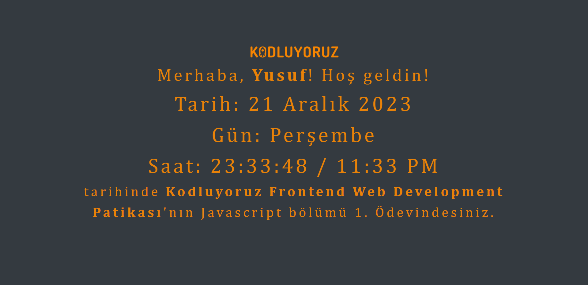

# Basic Clock App with JavaScript

Welcome to the Clock App project. This is a simple clock app created using JavaScript, HTML, and CSS. The project demonstrates how to use JavaScript to dynamically update the display of the current time.

## Usage
* Clone the repository.
* Open the `"index.html"` file in your web browser.
